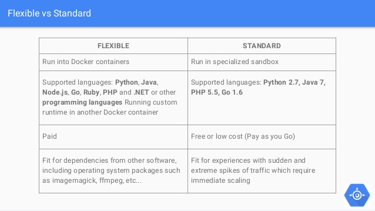

# Google Cloud - App Engine (Flex / Go) - Lab

## Overview of this lab

In this quick lab, we will play with gcloud App Engine.

At the end of the lab you will be able to:
- **deploy a simple Go application** on Google App Engine - Flexible environment (you don't have to understand Go)
- **split traffic** between 2 versions of you app
- do basic operations on your application: **see logs**, **ssh**, debug, view metrics, etc

This lab should take approximately 30 minutes.
You will need to use you own google cloud account.

## What is Google App Engine

Google App Engine (GAE) is a web framework and cloud computing platform for **developing and hosting** web applications in Google Cloud Platform. 
Applications are **sandboxed** and run across **multiple servers**. 
App Engine offers **automatic scaling** for web applications.

You can run your applications in App Engine using the flexible environment or standard environment:
- Using the **flexible environment** means that your application instances run within Docker containers on Google Compute Engine virtual machines.
- Using the **standard environment** means that your application instances run in a sandbox, using the runtime environment of a supported language listed below.

Let's start with a bit of terminology, your applications will use:
- service, basically one independant piece of software you want to deploy. Except if you are deploying micro-services, most of the time you app will have only 1 service.
- version, a deployable version of you app, your service can have several versions
- instance, when a version of a service is deployed, 1 or several instances are created. This is the running instance where you app is hosted.

In this Lab,we will focus on App Engine Flexible environnement.

## The Lab - step by step

### 0. Prerequisites

#### Create a project on GCP and activate billing

- Google to the [Google Cloud console](https://console.cloud.google.com)
- Click on Project List (in the header next to the Google Cloud Platform Logo), the "Create Project"
- Give it a "Name", select a billing account, then use the "Create" button

For more information about this prerequisite step please refer to the [official documentation](https://cloud.google.com/resource-manager/docs/creating-managing-projects#creating_a_project).

#### Install and configure Google Cloud SDK 

- Install the [Google Cloud SDK](https://cloud.google.com/sdk/docs/downloads-interactive) on your machine
- Configure you SDK with you gcloud account, select a project with the command line `$ gcloud init`

### 1. Prepare your application

#### Get the source code

- git clone this repository on you machine
- have a look to the helloworld.go file, it is a simple Go app doing an _Hello World_
- update the string `Hello mate, if you like this lab, please give me a star :)` by any other string, it could be `Hello World`

#### Make you local project ready for GCP

GCP is using a yaml configuration file to know how to deploy your application, let's create it.

Create an **app.yaml** file to describe you application, for that you can use the existing **app.yaml.template** as example.

Only 2 lines required are:
- `env: flex`, type of Google App Engine (GAE) project, GCP provided 2 type of environment: [Flexible or Standard](https://cloud.google.com/appengine/docs/the-appengine-environments).
- `runtime: go`, to tell GAE which runtime do you want to use.

I would also recommend to set the `service: YOUR_APP_NAME`, if not you application will be deployed in the default one (hope you are alone on your project if it is the case).

Please refer to the [official documentation](https://cloud.google.com/appengine/docs/flexible/python/configuring-your-app-with-app-yaml) to see all available options you could put in this file.

### 2. Deploy your application

#### Deploy you have using your terminal

To do so, just use this simple command line in you shell: `gcloud app deploy`.

It will ask you a few questions like in which region you do want to deploy the app. 
Then take a coffee, it could take up to 10 minutes for the app to be created.

#### Check the results in the google cloud online console

##### Notice the Docker image in the registry (Menu > Container Registry)

GCP App Engine Flexible environment is using Docker under the hood to deploy your application. You can see the built image in the registry.

##### Look at the build logs from the online console (Menu > Cloud Build > History)

The build process could fail for many reason: your app is broken, the app.yaml file is not valid...
To take a look to the logs of the build process, go the the GCP Cloud Build service.

##### Notice the created Service  with 1 version (Menu > App Engine > Service)

A service is a kind of application.
You should be able to see the created Service from the GCP console with the name you put in the app.yaml file.

From here, you can:
- see the number of version you service have (should be 1 at this stage)
- access application logs from the "Tool" menu

Then click on "Versions"

##### Notice the Version: status, traffic allocation, #instances  (Menu > App Engine > Version >> select your service)

This screen list all versions available for your service. Basically 1 version is created each time you deploy.
If you can't find your version, use the dropdown at the top to select the good service.

When you application is deployed, you should be able to see:
- Status -> Serving
- Traffic Allocation to 100%
- Instances 1 (or more according to your configuration)
- You can also take a look to the config file GCP linked to this version and look at the logs of your application.

You can also check the logs from your terminal: `gcloud app logs tail -s YOUR_APP_NAME`

This screen is important, this is where you can control traffic of your app: Stop a version, Start, Migrate or split traffic between several versions. 

##### Find Instances (Menu > App Engine > Instances >> select your service)

If you version is in serving state (started), 1 or more instances will be linked to it.
This screen allow you do see those instances, ssh on them

##### And then, view your deployed app

Click on the service name from the Service list or use the command `gcloud app browse -s YOUR_APP_NAME`

### 3. Create a 2nd version of your application

#### Update the message served by your application

Update the message served your helloworld.go file with something else (ie, from "Hello World" (set in pre-requisites) to "GAE is as simple as that")

#### Redeploy your app

Run the same command that previously: `gcloud app deploy`

##### Notice this 2nd version on the online console (Menu > App Engine > Version >> select your service)

Redeploying an application will create a new "Version" of it, the process is still take a bit of time but at the end of it you will be able to see you new version listed on the "Version" screen.

##### Test your second version

Exactly as before, if it is not ready within 2 minutes, wait a bit more :)
`gcloud app browse -s go-YOUR_APP_NAME`

### 4. Split traffic between those 2 versions

To do so, go the Versions (Menu > App Engine > Version >> select your service), then:
- start the previous version to have 2 versions with status “Serving”
- then select those 2 versions the click “Split Traffic button”
- select "Random" (easier to test that IP based), then set traffic allocation to 50% 50%

To test if it works:
- go back to the version list and notice the traffic allocation has been updated.
- then take another coffee or wait for 5 to 10 minutes. If you do prefer tea, sorry for you it won't work :)
- open your service in the browser and refresh many time
- After several refresh, you should see 2 different messages (1 by version)
If 1 of those fails (503) => wait more...

